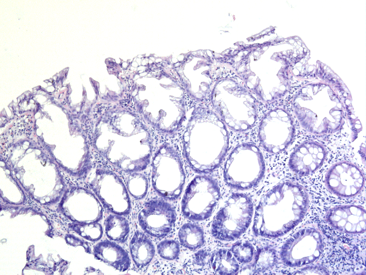
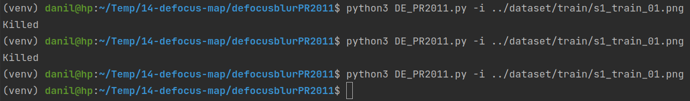
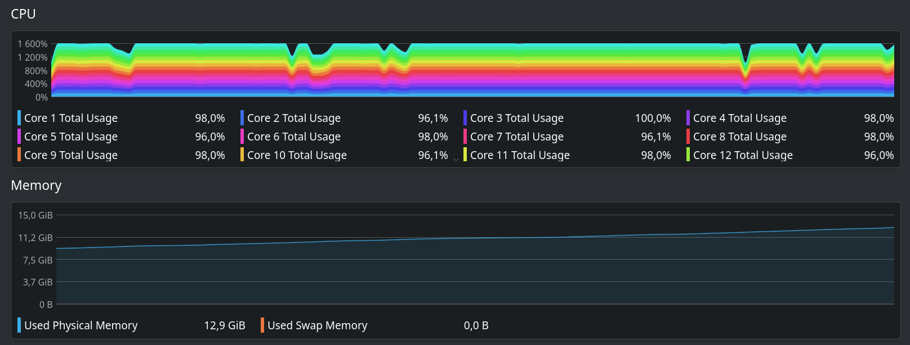
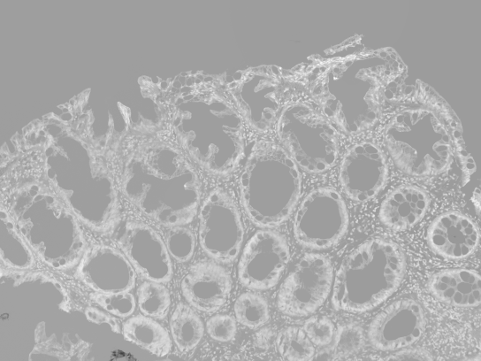
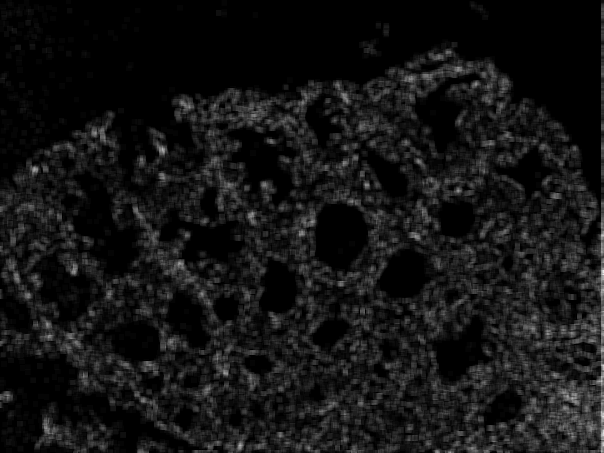

# Defocus map estimation
Поиск и запуск проектов, посвящённых Defocus map estimation.

Полезные ссылки:
- [Defocus map estimation from a single image](https://www.sciencedirect.com/science/article/abs/pii/S003132031100094X) - статья 2011 года;
- [Defocus Estimation](https://paperswithcode.com/task/defocus-estimation) - задача на Papers with Code;

Реализации:
- [alikaraali / defocusblurPR2011](https://github.com/alikaraali/defocusblurPR2011) - реализация статьи от 2011 года;
- [xinario / defocus_segmentation](https://github.com/xinario/defocus_segmentation)

Запуски всех проектов осуществлялись на изображениии `s1_train_01.png` из набора данных `S1-v2`:



#### alikaraali / defocusblurPR2011

В репозитории не хватало файла `requirements.txt`, составил список зависимостей:
```
opencv-python==4.5.3.56
scipy==1.5.4
scikit-image==0.18.3
```

Запуск проекта осуществляется командой:
```bash
python3 DE_PR2011.py -i ../dataset/train/s1_train_01.png
```
- `-i` - путь к изображению, для которого необходимо оценить `defocus map`.

Запуски проекта на изображении `s1_train_01.png` с различным разрешением:
- `2176 x 1632` - процесс был убит ОС, результата не дождался;
- `1088 x 816` - `cv2.resize(img, (0, 0), fx=0.5, fy=0.5)` - процесс был убит ОС, результата не дождался;
- `544 x 408` - `cv2.resize(img, (0, 0), fx=0.25, fy=0.25)` - есть результат;

Как выглядели запуски проекта в консоли:



Нагрузка на `CPU` и `RAM` при запусках:



Визуализация `defocus map` при третьем запуске с разрешением `544 x 408`:

| Оригинал                                     | `Defocus map`                                         |
|----------------------------------------------|-------------------------------------------------------|
|  |  |

#### xinario / defocus_segmentation

В репозитории не хватало файла `requirements.txt`, составил список зависимостей:
```
numpy==1.17.5  # release date 01.01.2020
opencv-python==4.1.2.30  # release date 22.11.2019
```

Запуск проекта осуществляется командой:
```bash
python3 lbpSharpness.py --input ../dataset/train/s1_train_01.png
```
- `--input` - путь к изображению, для которого необходимо оценить `defocus map`.

Первый запуск прошёл успешно:

| Оригинал                                     | `Sharpness map`                                |
|----------------------------------------------|------------------------------------------------|
|  |  |
 